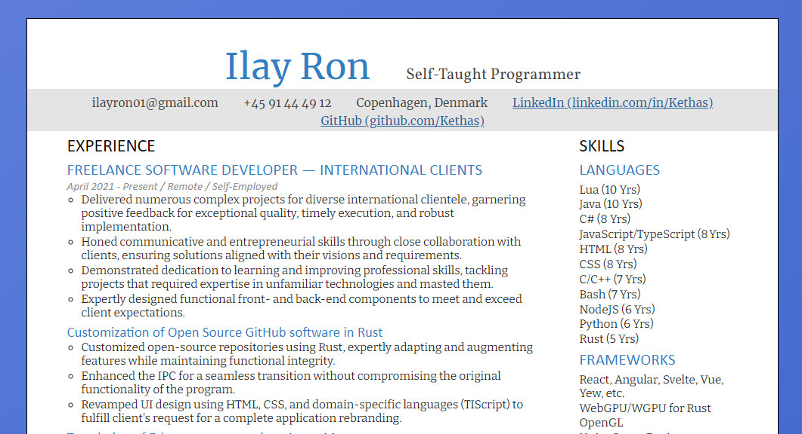

# Hi, I'm Ilay Ron

[See my CV here](https://cv.asphyx.dev/)

This is the source code for it.

It is written in HTML, CSS, Rust, and tiny bit of JavaScript.

The project is based on the [Yew Trunk Minimal Template](https://github.com/yewstack/yew-trunk-minimal-template), but has been modified quite a bit.

Note: My portfolio is WIP, and the links to it are not real.
